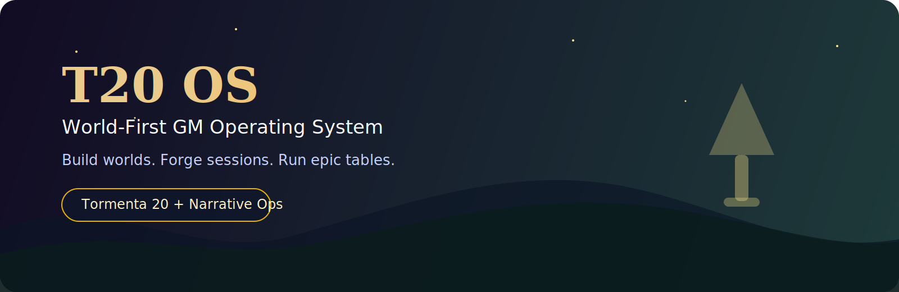
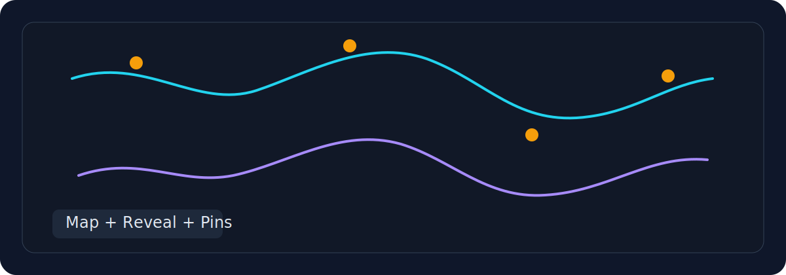
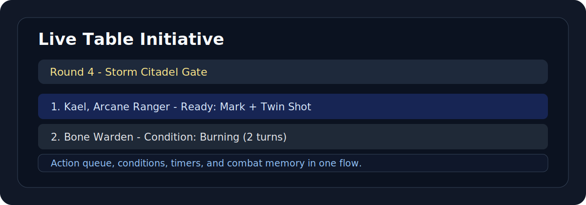

<div align="center">
  
</div>

<div align="center">

# T20 OS

**A world-first operating system for Game Masters**

[](https://nextjs.org/)
[](https://react.dev/)
[](https://www.typescriptlang.org/)
[](https://www.prisma.io/)
[](#architecture-and-planning-sources)

</div>

> This is not a generic dashboard.
> T20 OS is being forged as a cohesive GM war room: worldbuilding, prep, live table, world memory, and Tormenta 20 operations in one surface.

<div align="center">
  
</div>

## The Fantasy War Room Vision

Most GM workflows today are fragmented across random notes, pdfs, chats, image folders, spreadsheets, and memory.

`t20-rpg-toolkit` exists to collapse that fragmentation into a single coherent product where the world is the root context.

Core principles:

- world-scoped modeling over global shortcuts
- cockpit UX over page hopping
- complete module slices over fake MVP breadth
- explicit domain structure over hidden text blobs
- product cohesion over feature sprawl

## Product Pillars

- **Codex do Mundo**: entities, relationships, politics, lineages, continuity
- **Forja de Sessao**: prep pipelines, hooks, encounter setup, reveal planning
- **Mesa ao Vivo**: initiative, actions, conditions, map and reveal flow
- **Memoria do Mundo**: post-session continuity and event memory
- **Biblioteca Visual**: image-rich references tied to entities and sessions
- **Balanceamento T20**: encounter support and system-specific tooling

## Visual Identity Preview

<table>
  <tr>
    <td width="50%">
      
    </td>
    <td width="50%">
      
    </td>
  </tr>
</table>

<div align="center">
  
</div>

## Architecture and Planning Sources

Before making major product changes, read:

- [README](./README.md)
- [ARCHITECTURE.md](./ARCHITECTURE.md)
- [docs/00-strategy/t20-toolkit-master-plan.md](./docs/00-strategy/t20-toolkit-master-plan.md)
- [docs/00-strategy/attack-index.md](./docs/00-strategy/attack-index.md)
- active front plan in [docs/01-fronts](./docs/01-fronts)

Roadmap execution fronts:

1. Shell e Cockpit
2. Codex do Mundo
3. Grafo Narrativo
4. Biblioteca Visual
5. Forja do Mundo
6. Forja de Sessao
7. Mesa ao Vivo
8. Memoria do Mundo
9. Balanceamento T20

## Tech Stack

- Next.js 16
- React 19
- TypeScript 5
- Prisma + PostgreSQL
- Tailwind CSS 4 + Radix UI + Framer Motion
- MapLibre GL + Three.js / React Three Fiber
- Vitest

## Quick Start

### Prerequisites

- Node.js 20+
- npm
- Docker + Docker Compose

### Install

```bash
npm install
cp .env.docker.example .env.docker
```

### Start database

```bash
docker compose up -d db
```

### Run app (dev via Docker)

```bash
docker compose --env-file .env.docker up --build
```

### Optional tunnel for remote testing

```bash
npm run tunnel
```

Open:

- `http://127.0.0.1:3000`
- `http://localhost:3000`

For hardened runtime profile and security notes, see [ARCHITECTURE.md](./ARCHITECTURE.md) and the original operational docs in this repository.

## Useful Commands

```bash
npm run dev
npm run build
npm run start
npm run lint
npm run test
npm run test:run
```

## Branch and Delivery Discipline

- Never work directly on `master`
- Use branch prefix `codex/`
- Keep branch scope tight
- Open PR to `master`
- Use conventional commits
- Preferred merge mode: squash merge

Operationally complete means:

1. code committed
2. branch pushed
3. merged into `master`
4. branch deleted
5. local workspace back on `master`

## References

Local references used for domain inspiration live in [`references/`](./references):

- `gerador-ficha-tormenta20`
- `roll20_tormenta20_grimoire`
- `artonMap`
- `fichas-de-nimb-fvvt`
- `jarvez-mcp-rpg`

Use them for harvesting ideas, not blind copy.

## Author

**Guilherme Costa Proenca**

- GitHub: [@GuilhermeCostaProenca](https://github.com/GuilhermeCostaProenca)
